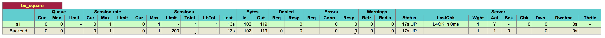

This repo accompanies the [Beginners guide to gateways and proxies](https://learncloudnative.com/blog/2020-04-25-beginners-guide-to-gateways-proxies/) article.


## Walkthrough

Let's start the example by running a simple proxy in-front of the `square` service. This will simply take the incoming requests and pass them to the instance of the square service.

The `./gateway/docker-compose.yaml` defines two services - `haproxy` and `square-service`. The `haproxy` service also mounts a volume - this is so we can include the `haproxy.cfg` file in the container.

>Another option would be to create a separate Dockerfile that is based on the HAProxy image and then copy the proxy configuration.

We are also exposing port `8080` (on the host) to be directed to the port `80` inside the container - this is where the HAProxy instance will be listening on and it's defined in the `haproxy.cfg` file.

Let's look at the contents of the `haproxy.cfg` file:

```
global
  maxconn 4096
  daemon

defaults
    log     global
    mode    http

    timeout connect 10s
    timeout client 30s
    timeout server 30s

frontend api_gateway
    bind 0.0.0.0:80
    default_backend be_square 

backend be_square
    server s1 square-service:8080
```

We are interested in two sections - **frontend** and **backend**. We are calling the frontend section `api_gateway` and this is where we define where the proxy will listen on as well as how to route the incoming traffic. We are simply setting a default_backend to the `be_square` backend that's defined right after the frontend section.

In the backend section we are creating a single server called `s1` with an endpoint `square-service:8080` - this is the name that we defined for the square service in the `docker-compose.yaml` file.

Let's run this and test the behavior - from the `./gateway` folder, run;

```
$ docker-compose up
Creating network "gateway_default" with the default driver
Creating gateway_square-service_1 ... done
Creating gateway_haproxy_1        ... done
Attaching to gateway_square-service_1, gateway_haproxy_1
square-service_1  | {"level":"info","msg":"Running on 8080","time":"2019-11-02T00:56:07Z"}
haproxy_1         | <7>haproxy-systemd-wrapper: executing /usr/local/sbin/haproxy -p /run/haproxy.pid -db -f /usr/local/etc/haproxy/haproxy.cfg -Ds
```

The docker-compose will do it's job, it will create a new network and two services. Run the `curl` command from a separate terminal window:

```
$ curl localhost:5000/square/12
144
```

You will also notice the log that gets written when the service is called. 

## Enabling stats

HAProxy is collecting a lot of stats on the requests, frontends, and backend servers. To enable the stats, add the following section to the end of the `haproxy.cfg` file:

```
listen stats
    bind *:8404
    stats enable
    stats uri /stats
    stats refresh 5s
```

The above section binds port `8404` to be available on the `/monitor` URL. Since we are exposing the stats on a different port, you also need to update the `docker-compose.yaml` file to expose that additional port. Add the line `"8404:8404"` under the ports key:

```
    ports:
      - "5000:80"
      - "8404:8404"
```

Restart the containers and see if you can get to the stats page (press CTRL+C if you still have docker-compose running):

```
$ docker-compose down
...
$ docker-compose up
...
```

Next, open `http://localhost:8404/stats` to see the stats for the frontend and backend. This page shows you the number of requests, sessions, and bunch of other stats. Make a couple of request to the `square` service and see how the stats page changes.

## Health checks

The simplest way you can add a health check for your backend services is to add the word `check` on the same line your server backend is defined. Like this:

```
server s1 square-service:8080 check
```

This instructs the HAProxy to do an active health check by periodically making a TCP request to the server.

Update the `haproxy.cfg` by adding the `check` keyword as shown above and restart the containers.

Next, you can open the HAProxy stats page (`http://localhost:8404/stats`) again to see the health check in action. Notice the row in the backend table has turned green as shown in figure below.



With the containers running, go back to the terminal and kill the container running the square service. First, run `docker ps` to get the container ID and then run `docker kill [container-id].

Alternatively, you use the name of the container (`gateway_square-service_1`) to kill it.

With the container killed, go back to the stats page and you will notice that the row that was previously green, has turned yellow and eventually red. This means that the health check is failing.

>If you hover over the column `LastChk`, you will also get a reason for the failing health check (Layer4 timeout)

## Denying requests

We want the square API users to use an API key when accessing the functionality. As a first step we can do is to deny any requests that don't have an API key header set. 

To do that, you can add the following line, right after the bind command in the frontend section:

```
http-request deny unless { req.hdr(api-key) -m found }
```

With this line we are telling the proxy to deny the request unless a header called `api-key` is found.

If you try to make the exact same request as before, you will get the 403 response from the proxy:

```
$ curl localhost:5000/square/12
<html><body><h1>403 Forbidden</h1>
Request forbidden by administrative rules.
</body></html>
```

However, if you add a header value, the request will work just fine: 

```
$ curl -H "api-key: hello" localhost:5000/square/12
144
```

## Rate limiting

In addition to requiring the API keys, we also want to rate-limit users, so they aren't making too many requests and causing unnecessary strain to our service.

To do that, we need to define a couple of things - let's explain each line separately first, and then see how to put it together.

1. We need a way to store/count the number of requests. For that purpose, you can use a stick table - it stores the number of requests and automatically expires after a certain period of time (`5m` in our case):

```
stick-table type string size 1m expire 5m store http_req_cnt
```

1. We also need to set a limit after which we will be denying request. You can do that using an ACL where we check if the number of requests with a specific `api-key` header value exceeds the limit - we set it to 10, so it's easier to test:

```
acl exceeds_limit req.hdr(api-key),table_http_req_cnt(api_gateway) gt 10
```

1. If the limit is not exceeded, let's track the current request:

```
http-request track-sc0 req.hdr(api-key) unless exceeds_limit
```

1. Finally, we need to deny the request if limit is exceeded:

```
http-request deny deny_status 429 if exceeds_limit
```

The final frontend configuration should then look like this:

```
frontend api_gateway
    bind 0.0.0.0:80

    # Deny the request unless the api-key header is present
    http-request deny unless { req.hdr(api-key) -m found }

    # Create a stick table to track request counts
    # The values in the table expire in 5m
    stick-table type string size 1m expire 5m store http_req_cnt

    # Create an ACL that checks if we exceeded the value of 10 requests 
    acl exceeds_limit req.hdr(api-key),table_http_req_cnt(api_gateway) gt 10
    

    # Track the value of the `api-key` header unless the limit was exceeded 
    http-request track-sc0 req.hdr(api-key) unless exceeds_limit

    # Deny the request with 429 if limit was exceeded
    http-request deny deny_status 429 if exceeds_limit

    default_backend be_square 
    ....
```


Restart the containers and try it out - make 10 requests and on the eleventh request, you will get the following response back:

```
$ curl -H "api-key: hello" localhost:5000/square/12
<html><body><h1>429 Too Many Requests</h1>
You have sent too many requests in a given amount of time.
</body></html>
```

You can wait for 5 min to check that the table expires, or you can also try making requests using a different `api-key` header value, since we are tracking the value of it:

```
$ curl -H "api-key: TEST" localhost:5000/square/12
144
```

Finally, let's check the stats again - specifically the Denied column in the `api_gateway` section. You should see the number of denied requests there.
